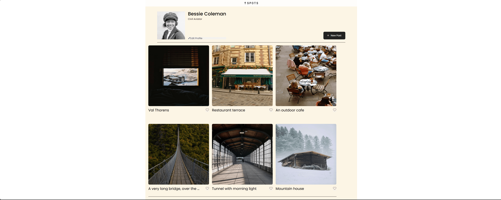
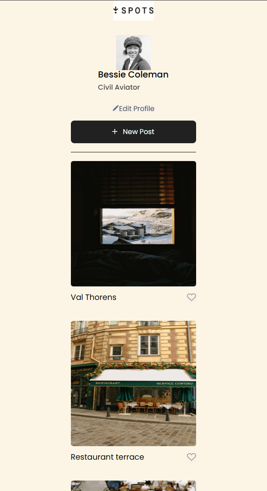

# Project 3: Spots

### Technologies & Techniques Used

- HTML 5: Semanticmarkup
- CSS3: Flexbox layouts, CSS Grid, responsive design
- JavaScript: DOM manipulation, event handling, modal functionality
- BEM Methodology: Organized CSS class naming
  
  

### Project Functionality

Users can:

- View a gallery of images in a responsive grid layout
- Click imagse to open them in a modal preview
- Add new posts through a form modal
- Edit their profile information
- Like and interact with posts

### Features Demonstrated

- responsive design that works on mobile and desktop
- Interactive modals for image preview and forms

This project was testing all the skills weve learned in order to make a social media web page from scratch. -[link to project](https://emmanuelgutierrez777.github.io/se_project_spots/)
[Recording](https://drive.google.com/file/d/1TTGBTYkNhvpQwDSj3TfVrUrLz5oCp6K-/view?usp=drive_link)

**Figma**

- [Link to the project on Figma](https://www.figma.com/file/BBNm2bC3lj8QQMHlnqRsga/Sprint-3-Project-%E2%80%94-Spots?type=design&node-id=2%3A60&mode=design&t=afgNFybdorZO6cQo-1)

**Images**

